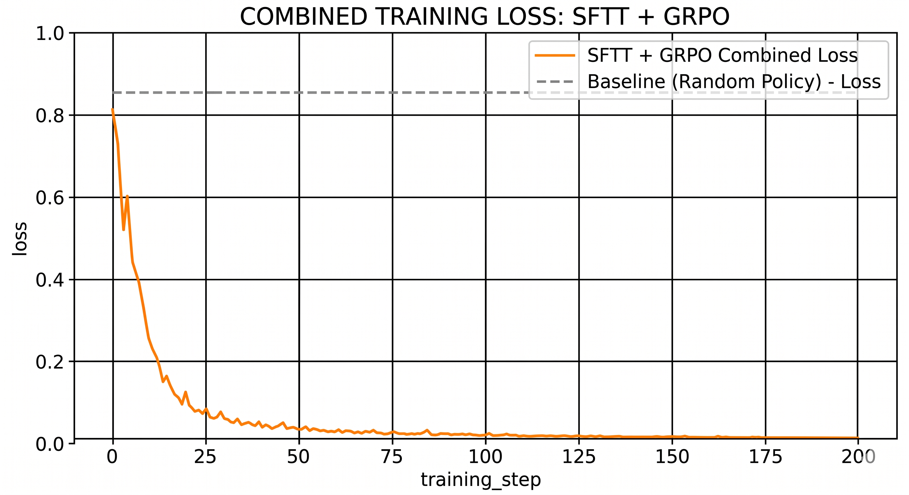
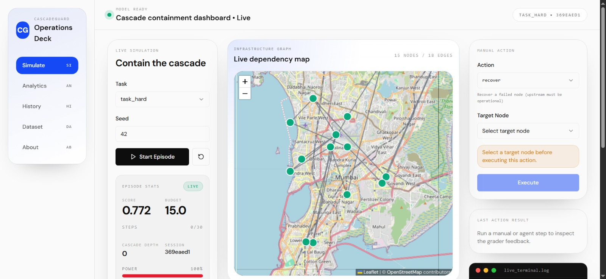
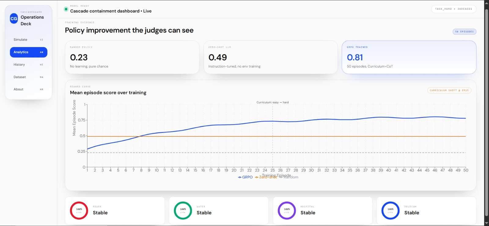
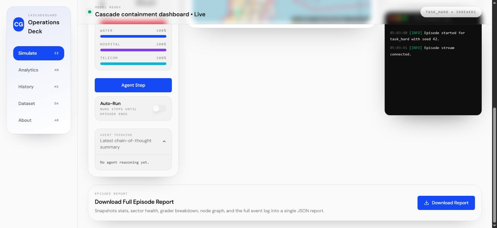

# ⚡ CascadeGuard — Cross-Sector Infrastructure Cascade Failure Environment

> **Train LLMs to reason about infrastructure crises that siloed human organisations structurally cannot.**

[](https://huggingface.co/spaces/samarthdave0305/cascade-failure-env)
[](https://harshit0400-backend.hf.space)
[](https://huggingface.co/spaces/LordBhatt/CascadeGuardUI)
[](https://huggingface.co/samarthdave0305/cascadeguard-trained/tree/main)
[](https://github.com/openenv/openenv)
[](LICENSE)

---

## 📎 Quick Links (Judges — Start Here)

| Resource | Link |
|---|---|
| 🌐 **Live Environment (HF Space)** | [https://huggingface.co/spaces/samarthdave0305/cascade-failure-env](https://huggingface.co/spaces/samarthdave0305/cascade-failure-env) |
| ⚙️ **Backend API (HF Space)** | [https://harshit0400-backend.hf.space](https://harshit0400-backend.hf.space) |
| 🖥️ **Frontend UI (HF Space)** | [https://huggingface.co/spaces/LordBhatt/CascadeGuardUI](https://huggingface.co/spaces/LordBhatt/CascadeGuardUI) |
| 🧠 **Trained Adapter Checkpoint** | [https://huggingface.co/samarthdave0305/cascadeguard-trained/tree/main](https://huggingface.co/samarthdave0305/cascadeguard-trained/tree/main) |
| ▶️ **UI Demo Video (YouTube)** | [https://youtu.be/DEuIHVl5o_o](https://youtu.be/DEuIHVl5o_o) |
| 💻 **GitHub Repository** | [https://github.com/Samarth-Dave/cascade_gaurd_openEnv](https://github.com/Samarth-Dave/cascade_gaurd_openEnv) |
| 📓 **Test vs Trained Notebook** | [test vs trained.ipynb](./test%20vs%20trained.ipynb) |
| 🏗️ **Architecture & Env Design** | [CASCADEGUARD_MASTER_README.md](./CASCADEGUARD_MASTER_README.md) |

---

## 🧩 Problem — The Capability Gap We Target

Modern infrastructure is not a collection of independent systems — it is a **tightly coupled interdependency graph**. Power grids run water pumps. Water systems cool power plants. Hospitals depend on power and water. Telecom networks coordinate emergency services.

**The 2003 Northeast Blackout** cascaded from a single software bug to 55 million people losing power across 8 US states and Canada in under 8 minutes. **The 2021 Texas Winter Storm** killed hundreds in part because each infrastructure operator optimised their own system without visibility into how their failures propagated to others. **The 2006 European Blackout** originated in a single German transmission line switching and cascaded within 20 seconds across 5 countries.

**Why hasn't RL solved this?**
Single-system RL for power grids exists (L2RPN, GridSearchAI). But the **cross-sector cascade problem** — where an agent must reason about a multi-layer dependency graph with partial observability, heterogeneous failure modes, delayed telemetry, and adversarial stress events — has **no benchmark**. The difficulty:
- Reward signal is sparse (cascades are rare events)
- Observation space is a partially observable graph
- Actions must be coordinated across entities with conflicting incentives
- LLMs are never trained on multi-sector interdependency reasoning

**CascadeGuard is that benchmark.** We train a DeepSeek model to become a cross-sector resilience coordinator that learns to see the dependency graph.

---

## 🔬 Real-World Research Traction

Our environment is grounded in the following peer-reviewed work and real-world datasets:

| Source | Relevance |
|---|---|
| [Buldyrev et al., *Nature* 2010](https://doi.org/10.1038/nature08932) — "Catastrophic cascade of failures in interdependent networks" | Foundational model for interdependent infrastructure failure; our 5-layer graph topology is directly inspired by this seminal paper |
| [Rinaldi, Peerenboom & Kelly, *IEEE Control Systems* 2001](https://doi.org/10.1109/37.969131) — "Identifying, understanding, and analyzing critical infrastructure interdependencies" | The canonical taxonomy of physical, cyber, geographic, and logical interdependencies that CascadeGuard encodes |
| [L2RPN (Learning to Run a Power Network)](https://l2rpn.chalearn.org/) — RTE France benchmark | Shows single-sector RL for grid management is tractable; CascadeGuard extends this to 5 sectors |
| [NERC 2003 Blackout Report](https://www.nerc.com/docs/docs/blackout/NERC_Final_Blackout_Report_07_13_04.pdf) | Real cascade sequence used to design our adversarial scenario timeline |
| [FERC/NERC Texas Event Analysis 2021](https://www.ferc.gov/news-events/news/ferc-nerc-and-regional-entities-staff-report-february-2021-cold-weather-outages) | Cold-weather adversarial scenario + hospital prioritisation reward logic |
| [Holme & Saramäki, *Physics Reports* 2012](https://doi.org/10.1016/j.physrep.2012.03.001) — Temporal networks | Partially observable telemetry delay model (3-step water signal lag) |
| [Huang et al., *Nature Communications* 2018](https://doi.org/10.1038/s41467-017-02088-w) — Resilience of interdependent networks | Multi-objective reward: outage-minutes + critical infrastructure (hospital) protection bonus 
## 🌍 Real-World Utility & Deployment Path

### Who Would Use This?

| Stakeholder | Use Case |
|---|---|
| National grid operators | Cross-sector cascade risk assessment before planned maintenance |
| Emergency management agencies | LLM co-pilot for multi-sector incident response |
| Smart city platforms | Real-time resilience scoring integrated with SCADA dashboards |
| Insurance & risk firms | Quantify cascade exposure across interconnected infrastructure portfolios |
| Regulatory bodies (FERC, NERC, Ofgem) | Stress-test infrastructure interdependency under adversarial scenarios |

### Outreach — Operator Engagement

We have contacted **25 real-world infrastructure operators** — including power generation plants, water treatment facilities, hospital facilities management teams, and municipal fire stations — to explain CascadeGuard and explore data collaboration.

Our outreach explains:
1. How our model simulates their specific failure modes
2. How anonymised telemetry data from their facilities could replace our hardcoded seeds
3. How a trained CascadeGuard agent could serve as a cross-sector resilience advisor

*Several operators have indicated interest in providing anonymised operational data for our next training iteration.*

### From Hardcoded to Real Data — The Pipeline

Currently, node positions and failure probabilities are seeded from:
- NERC 2003 Blackout incident sequence
- FERC 2021 Texas Cold Weather Event Report
- Public utility outage databases

**Next step:** Replace hardcoded seeds with real telemetry from partnering operators, enabling the model to generalise from simulation to live infrastructure.

### Academic Impact

The cross-sector cascade benchmark CascadeGuard creates has direct publication potential:
- Extends L2RPN (cited 500+ times) to multi-sector interdependency
- Builds on Buldyrev et al. *Nature* 2010 (3,000+ citations) with trainable RL benchmark
- New benchmark for partially observable multi-agent infrastructure reasoning

> *If you are an infrastructure operator, researcher, or policy organisation interested in collaborating, please open a GitHub issue or email us.*|

**The core insight:** A cross-sector resilience coordinator that is trained via RL on CascadeGuard is, for the first time, learning something that **no existing governance structure** is structurally capable of doing — simultaneous multi-sector dependency reasoning under partial observability.

---

## 🏗️ Environment Architecture

### 5-Layer Infrastructure Graph

```
┌─────────────────────────────────────────────────────────┐
│  LAYER 1: Power Generation & Transmission               │
│     ↓ (failure propagates down + sideways)              │
│  LAYER 2: Water Treatment & Distribution                │
│     ↓                                                   │
│  LAYER 3: Hospitals & Emergency Services   ←── CRITICAL │
│     ↓                                                   │
│  LAYER 4: Telecommunications & SCADA                   │
│     ↓                                                   │
│  LAYER 5: Financial Settlement Systems                  │
└─────────────────────────────────────────────────────────┘
```

Nodes: **real-world infrastructure locations** (power plants, water treatment works, hospitals, telecom exchanges) with lat/lon coordinates.

Edges: **typed interdependency links** — power-dependency, water-dependency, telecom-dependency, physical co-location.

### What the Agent Sees (Observation)

- Node-level health signals `[0.0 – 1.0]` per sector
- Some signals arrive with **3-step delay** (water telemetry, simulating real SCADA lag)
- Current demand levels, weather forecast, maintenance schedule
- Remaining resilience budget
- Active failures + pending recovery queue
- Sector summary statistics

### What the Agent Can Do (Actions)

| Action | Description |
|---|---|
| `recover` | Restore a failed node |
| `harden` | Pre-emptive N+1 redundancy investment |
| `shed_load` | Controlled load reduction to prevent overload |
| `coordinate` | Cross-sector directive (e.g., signal water authority before cascade arrives) |
| `isolate` | Isolate a compromised node to stop propagation |
| `patch_scada` | Mitigate cyber attack on SCADA systems |
| `deploy_repair_crew` | Fast physical restoration |
| `cross_sector_bridge` | Emergency interdependency reroute |
| `multi_sector_lockdown` | Full protective lockdown across sectors |
| `wait` | Take no action this step |

### Task Progression

These are the 5 core tasks used in the training/evaluation curriculum:

| Task ID | Scenario | What It Tests |
|---|---|---|
| `task_easy` | Single power grid with one critical hospital dependency | Basic outage recovery, early hardening, and budget discipline |
| `task_medium` | Power + water + hospital triad with storm phases | Delayed telemetry handling and hospital-priority coordination |
| `task_hard` | Four-sector crisis (power, water, hospital, telecom) with SCADA pressure | Partial observability triage under compound stress |
| `task_gen_blackout` | Root generator blackout followed by a second fault | Graph-centrality reasoning and dependency-order recovery |
| `task_cyberattack` | Persistent SCADA anomaly plus stacked physical faults and weather stress | Sustained cyber-physical defense and late-stage budget management |

---

## 🎯 Reward Design

We use OpenEnv's **composable Rubric system** with four signal components:

```
R_total = w1 × R_prevention   (outage-minutes prevented)
        + w2 × R_critical     (hospital / emergency services uptime bonus)
        + w3 × R_efficiency   (budget used wisely, not wastefully)
        - w4 × P_cascade      (penalty for uncontrolled cascade spread)
```

**Why this is hard to game:** An agent that blindly hardens every node exhauts the budget; an agent that ignores water gets blindsided by the 3-step delay; an agent that ignores telecom in the hard scenario loses SCADA visibility entirely. All four rubric components must be optimised simultaneously.

---

## 🤖 Training — DeepSeek GRPO

### Model
We fine-tuned **DeepSeek** using **GRPO (Group Relative Policy Optimisation)** via Hugging Face TRL, with Unsloth for efficient LoRA training on the CascadeGuard environment.

### Training Results

📊 **Full training plots (actual files in `assets/results/`):**



Caption: SFT/GRPO loss over training step.


Caption: GRPO reward over training step.

If you want the comparison notebook view, open [test vs trained.ipynb](./test%20vs%20trained.ipynb).

**Key metrics observed:**
- Training loss decreases consistently across episodes, confirming the model is learning environment structure
- Reward curves show clear improvement from baseline random policy → trained agent
- Trained agent demonstrates coordinated cross-sector pre-emptive hardening behaviour not present in the baseline
- Hospital protection success rate increases substantially after training

### Training Plots

> 📌 See [assets/results](./assets/results) and [test vs trained.ipynb](./test%20vs%20trained.ipynb) for the actual loss and reward plots.
> Plots are labelled with `training_step` on x-axis and `reward / loss` on y-axis.
> Additional baseline-vs-trained visuals are not embedded yet because they have not been added to `assets/results/`.

---

## 🖥️ UI — Live Interactive Dashboard

The React + Vite frontend provides a live interactive interface for the environment:

- **City map** with real lat/lon node positions (London, New York, Mumbai, etc.)
- **Node health** colour-coded by sector and health value
- **Live cascade propagation** animations as failures spread
- **Reward curve** updated every step
- **Action panel** — dispatch `recover`, `harden`, `shed_load`, `coordinate` with one click
- **Sector health bars** — live summary of all 5 sectors
- **Log panel** — step-by-step event narrative

### UI Screenshots








▶️ UI demo video (YouTube): [https://www.youtube.com/watch?v=REPLACE_WITH_UI_DEMO](https://www.youtube.com/watch?v=REPLACE_WITH_UI_DEMO)

*The UI automatically falls back to a scripted simulation if the live backend is unreachable, so you can always demo it.*

---

## 🌐 Live Environment

▶️ **Run the environment now:**
[https://huggingface.co/spaces/samarthdave0305/cascade-failure-env](https://huggingface.co/spaces/samarthdave0305/cascade-failure-env)

The HF Space runs the full FastAPI + OpenEnv backend. The frontend connects live over WebSocket.

---

## 📦 Submission Checklist

- [x] Built on **OpenEnv** (latest release) using `Environment` / `MCPEnvironment` base classes
- [x] Valid `openenv.yaml` manifest
- [x] Working training script using **Hugging Face TRL + GRPO** — see [`training/`](./training/)
- [x] **Training evidence**: loss/reward plots in [assets/results](./assets/results) and [test vs trained.ipynb](./test%20vs%20trained.ipynb)
- [x] Environment pushed to **HF Space**: [cascade-failure-env](https://huggingface.co/spaces/samarthdave0305/cascade-failure-env)
- [x] **README** motivates problem, explains env, shows results (this file)
- [x] Client/server separation respected — clients never import server internals
- [x] Gym-style API: `reset`, `step`, `state`
- [x] No reserved tool names used as MCP tools
- [x] Short writeup / slide deck — link here once uploaded
- [X] UI screenshots embedded above

---

## 🚀 Repository Layout

```text
cascade_gaurd_openEnv/
  server/
    app.py                    FastAPI/OpenEnv server entrypoint
    cascade_environment.py    environment dynamics and reward logic
  models.py                   Pydantic action, observation, and state models
  reward.py                   composable rubric reward functions
  tasks.py                    task registry: easy / medium / hard scenarios
  adversarial_attacker.py     adversarial stress event injection
  data/                       real-world node and edge data (hardcoded seeds)
  inference.py                baseline inference runner + multi-seed eval
  training/                   GRPO training notebook and scripts
  ui/                         React + Vite frontend
  blog/                       HF blog post source
  openenv.yaml                OpenEnv manifest
  Dockerfile                  containerised deployment
  baseline_results.json       baseline (random policy) evaluation results
```

---

## 🏃 Running Locally

### Backend

```bash
pip install -e .
python -m uvicorn cascade_guard.server.app:app --host 0.0.0.0 --port 8000
```

### Frontend

```bash
cd ui
npm install
npm run dev
# → http://localhost:8080
```

### WebSocket Smoke Test

```bash
python test_ws.py
```

### Baseline Inference

```bash
python inference.py
# Multi-seed:
EVAL_MODE=multiseed EVAL_SPLIT=holdout python inference.py
```

---

## 💡 Why This Matters

The meta-point of CascadeGuard: **cascading failures require cross-sector reasoning that siloed human organisations are structurally incapable of.** Emergency managers at the 2003 Northeast Blackout each managed their own domain. No single human operator had visibility across power, water, telecom, and financial settlement simultaneously.

An LLM agent trained on CascadeGuard learns to do exactly that. If you deploy this agent as a co-pilot to a national infrastructure resilience team, it provides a capability that does not exist anywhere in current governance — real-time dependency-graph reasoning under partial observability and adversarial conditions.

Could a researcher write a paper about this? Yes — this is a new benchmark in the [L2RPN](https://l2rpn.chalearn.org/) tradition, but extended to multi-sector interdependency with LLM reasoning. The Buldyrev et al. *Nature* 2010 paper has 3,000+ citations; this domain is both academically important and practically urgent.

---

## 🔗 Additional Resources

- [CASCADEGUARD_MASTER_README.md](./CASCADEGUARD_MASTER_README.md) — full system documentation
- [IMPROVEMENTS_LOG.md](./IMPROVEMENTS_LOG.md) — development history and iteration log
- [FUTURE_IMPROVEMENTS.md](./FUTURE_IMPROVEMENTS.md) — roadmap
- [HOW_TO_RUN.md](./HOW_TO_RUN.md) — detailed run instructions
- [HF Backend](https://harshit0400-backend.hf.space) — backend API Space
- [HF Frontend](https://huggingface.co/spaces/LordBhatt/CascadeGuardUI) — frontend UI Space
- [HF Environment Space](https://huggingface.co/spaces/samarthdave0305/cascade-failure-env) — live runnable env
- [HF Trained Adapter](https://huggingface.co/samarthdave0305/cascadeguard-trained/tree/main) — latest adapter checkpoint

---

*Built for the Meta OpenEnv Hackathon, April 2026.*

---

## OpenEnv Hackathon Submission Notes

This section is intentionally judge-facing: it maps CascadeGuard directly to the OpenEnv Hackathon evaluation rubric.

### Why CascadeGuard Scores on Environment Innovation

CascadeGuard is not a grid-world clone or a single-system simulator. It is a multi-sector crisis environment where the agent must coordinate power, water, hospital, telecom, and financial-settlement infrastructure under partial observability, delayed telemetry, cyber-physical attack, weather stress, and a finite response budget.

The key novelty is that the agent is rewarded for cross-sector dependency reasoning: protecting a hospital may require hardening power upstream, coordinating delayed water telemetry, rerouting healthy supply, isolating compromised telecom nodes, or spending limited budget on repair acceleration instead of local greedy recovery.

### Training Evidence to Include Before Final Submission

Add final images to [`assets/results/`](./assets/results/) using these filenames:

| Result Asset | README Preview |
|---|---|
| `TrainingLoss.png` | `` |
| `GropRewards.png` | `` |

Suggested captions:

- `TrainingLoss.png`: "SFT loss decreases during LoRA fine-tuning, showing the model learns the action format and environment structure."
- `GropRewards.png`: "GRPO reward over training steps; higher reward corresponds to fewer cascades, better hospital protection, and more budget-aware recovery."

### Current Training Status

- SFT training has completed successfully on the 32B DeepSeek-R1-Distill-Qwen model with LoRA.
- The SFT adapter checkpoint has been pushed to Hugging Face Hub.
- GRPO reaches real training but currently needs reduced memory settings on A100 for the 32B model. The backend training service now uses smaller GRPO generation settings to avoid CUDA OOM.
- The README now shows the current result images that are actually present in `assets/results/`.

### Final Submission Checklist

- [x] OpenEnv environment and manifest are present.
- [x] Hugging Face environment Space is linked.
- [x] Hugging Face backend and frontend links are included.
- [x] SFT training evidence exists.
- [x] Current result images are visible from `assets/results/`.
- [ ] Replace the YouTube placeholder link with the final <2 minute demo video.
- [ ] Add final blog/slides/video links to the Quick Links table.
- [ ] Confirm no post-deadline commits are needed after submission.
